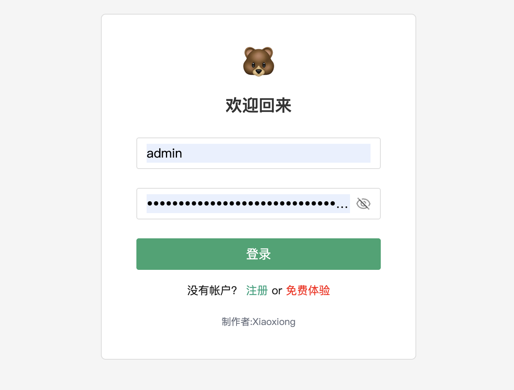
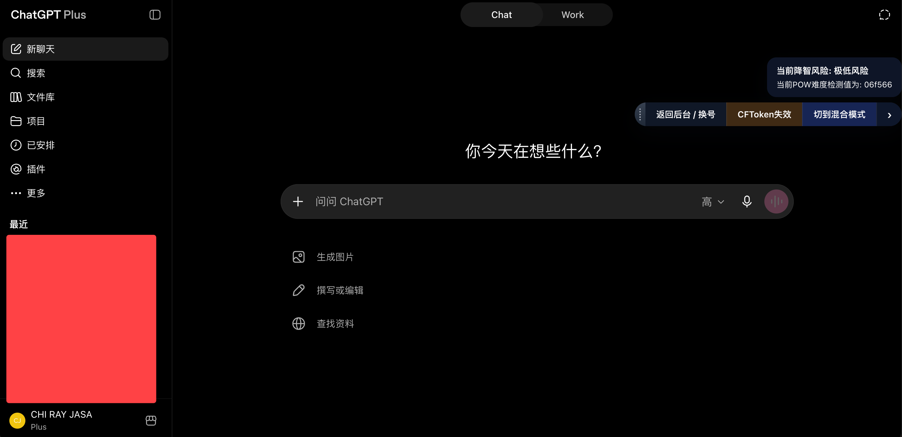
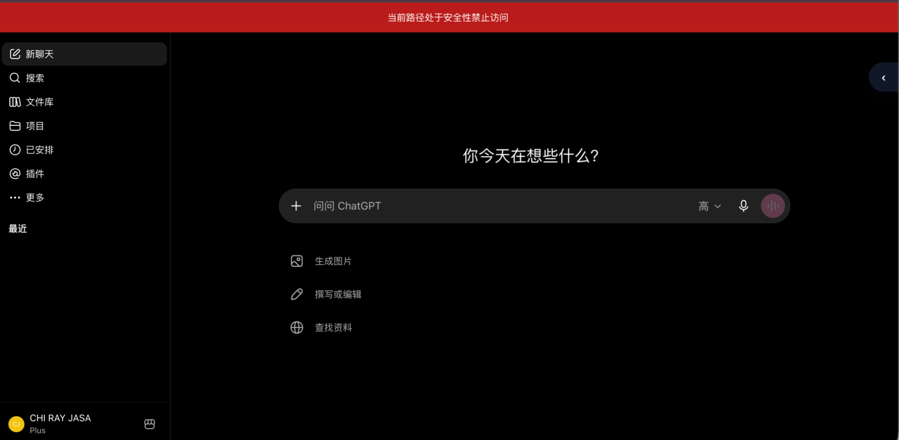

# ChatGPT Mirror

ChatGPT Mirror 是一个面向多用户场景的 ChatGPT 镜像管理项目，提供用户登录、账号管理、模型权限控制、访问记录和站点配置等功能。

## 技术栈

- 管理后台：Vue 3、TypeScript、Vite、Pinia、TDesign Vue Next
- 服务端：Python、Django 5.1、Django REST Framework
- 数据存储：SQLite
- 部署方式：Docker Compose

## 功能概览

- 用户登录与访问权限管理
- ChatGPT 账号统一维护
- 用户可用模型配置
- 使用次数与访问记录统计
- 自定义禁止访问路径
- 代理配置与连通性测试
- 自定义脚本配置
- ChatGPT 号池管理
- Vue 管理后台与 Django 服务端
- Docker Compose 部署支持

## 效果展示

### 登录界面



### ChatGPT 界面



### 禁止访问路径



### 操作演示

[▶ 查看演示视频](./imageandvideo/演示1.mp4)

> GitHub 页面无法直接播放视频时，可点击链接查看或下载原始文件。

## 项目结构

```text
chatgpt-mirror/
├── backend/          # Django 服务端
├── frontend/         # Vue 管理后台
├── imageandvideo/    # README 图片与演示视频
├── docker-compose.yml
└── vps-docker-compose.yml
```

## 快速开始

### 环境要求

- Docker Engine
- Docker Compose v2
- 可用的 HTTPS 域名（生产环境推荐）

### Docker Compose

根据 `docker-compose.yml` 准备好 `.env` 中要求的管理员密码、服务密钥和 Django 安全配置，然后在项目根目录执行：

```bash
docker compose up -d --build
```

查看服务状态：

```bash
docker compose ps
```

查看运行日志：

```bash
docker compose logs -f
```

停止服务：

```bash
docker compose down
```

### 前端开发

```bash
cd frontend
npm install
npm run dev
```

开发页面默认访问地址：`http://localhost:40002/`。

可用命令：

```bash
npm run dev      # 启动开发服务器
npm run build    # 类型检查并构建生产资源
npm run preview  # 本地预览构建结果
```

## 管理后台

登录后可以使用以下管理功能：

- 用户管理：维护用户状态、权限和模型限制
- ChatGPT 账号：添加和维护账号信息
- 号池管理：配置账号池及用户关联
- 访问日志：查看站点访问记录
- 代理：维护代理配置并测试连通性
- 脚本：维护自定义脚本配置
- 访问限制：配置禁止访问的路径


## 使用提示

- 本项目仅供学习、研究和合法授权场景使用。
- 使用者应自行遵守 OpenAI 服务条款及所在地法律法规。
- 请勿共享账号凭据、访问令牌、Cookie 或其他敏感信息。
- 上游页面和接口可能随时变化，部署后请持续关注兼容性。

## 更多说明

env文件格式：

ADMIN_USERNAME=admin

ADMIN_PASSWORD=xxxxxxxxxxxxx你的密码

GATEWAY_ADMIN_SECRET=xxxxxxxxxxx随机填写

DJANGO_SECRET_KEY=随机填写

DJANGO_ALLOWED_HOSTS=django,localhost,127.0.0.1,你的域名

DJANGO_CSRF_TRUSTED_ORIGINS=https://你的域名


## 冷知识
### 录入 token 时使用getCookie 插件获取全部 netscape 格式的内容可以一键导入哦！