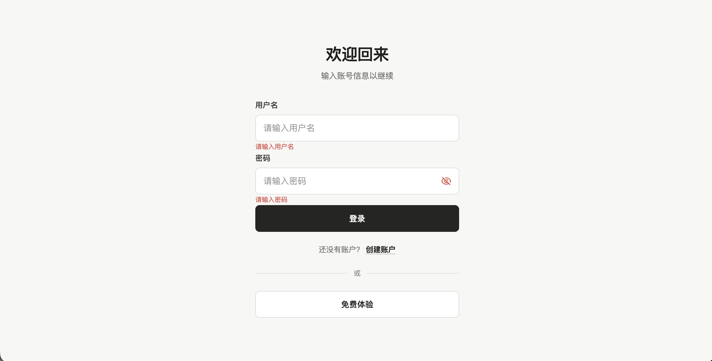
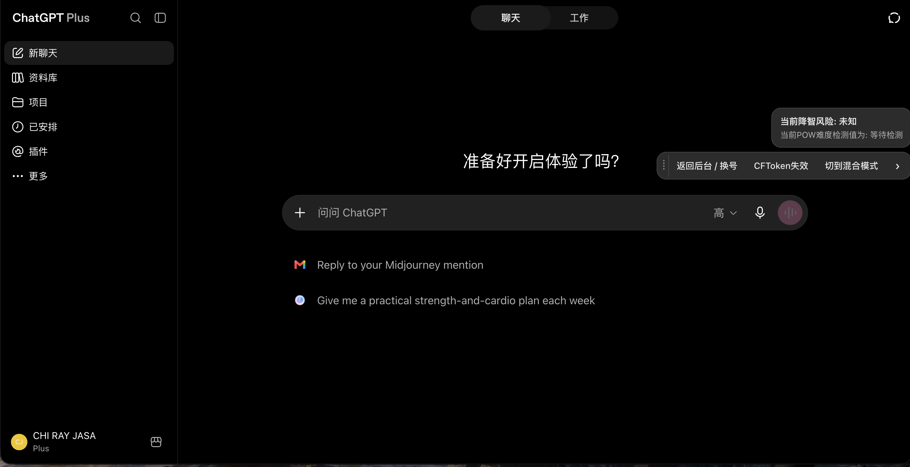
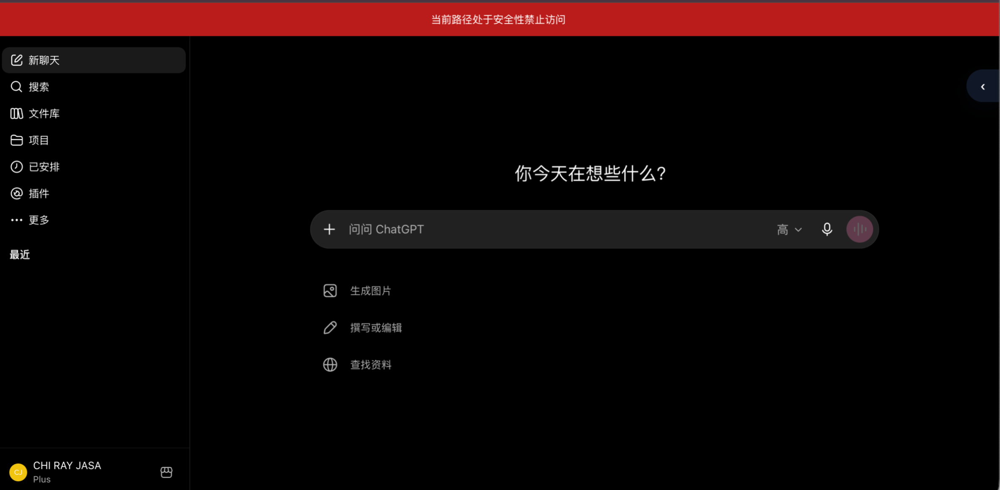

# ChatGPT Mirror

ChatGPT Mirror 是一个面向多用户场景的 ChatGPT 镜像管理项目，提供用户登录、账号管理、权限控制、访问记录和站点配置等功能。管理员可以集中维护可用账号和用户权限，普通用户通过统一入口访问已获授权的功能。

项目重点关注多用户使用、共享账号隔离、移动端兼容、弱网体验和日常运维，适合个人学习、内部研究及其他获得合法授权的非商业场景。

> 项目仍在持续适配上游变化。核心代理与兼容性组件属于非开源部分，本 README 不公开其内部结构和实现细节。部分公开的源代码与实际可能有出入

## 目录

- [技术栈](#技术栈)
- [功能概览](#功能概览)
- [效果展示](#效果展示)
- [项目结构](#项目结构)
- [快速开始](#快速开始)
- [管理后台](#管理后台)
- [安全与使用边界](#安全与使用边界)
- [使用许可](#使用许可)
- [更新日志](#更新日志)

## 技术栈

- 管理后台：Vue 3、TypeScript、Vite、Pinia、TDesign Vue Next
- 管理服务：Python、Django 5.1、Django REST Framework
- 数据存储：SQLite
- 部署方式：Docker Compose

## 功能概览

- **用户与权限**：管理用户状态、访问权限、可用模型和使用限制。
- **账号管理**：集中维护 ChatGPT 账号，支持 Cookie 和 Refresh Token 两种录入方式。
- **号池分配**：通过账号池组织可用账号，并按用户分配访问范围。
- **共享账号隔离**：不同镜像用户共用上游账号时，尽可能隔离普通对话、归档、搜索、标题和删除操作。
- **使用记录**：查看访问记录、使用次数和运行状态，便于日常管理与排查。
- **站点配置**：管理代理、连通性测试、自定义脚本和禁止访问路径。
- **多端兼容**：持续适配桌面浏览器、iPhone Safari 和 iPhone Chrome 等访问环境。
- **部署运维**：提供本地及 VPS 的 Docker Compose 编排，便于启动、更新和查看日志。

## 效果展示

### 登录界面



### ChatGPT 界面



### 禁止访问路径



### 操作演示

[▶ 查看演示视频](./imageandvideo/演示1.mp4)

> GitHub 页面无法直接播放视频时，可点击链接查看或下载原始文件。

## 项目结构

```text
chatgpt-mirror/
├── backend/                 # 管理服务
├── frontend/                # 管理后台
├── imageandvideo/           # README 图片与演示视频
├── docker-compose.yml       # 本地部署编排
└── vps-docker-compose.yml   # VPS 部署编排
```

> 非开源组件未在项目结构中展开。

## 快速开始

### 环境要求

- Docker Engine
- Docker Compose v2
- 可用的 HTTPS 域名（生产环境推荐）

### 配置与启动

根据所使用的 Compose 文件，在项目根目录创建 `.env`，补齐以下配置：

- 管理员账号和强密码
- 服务之间使用的独立随机密钥
- Django 安全密钥、允许访问的域名和可信来源
- 生产环境域名及其他部署参数


启动服务：

```bash
docker compose pull && docker compose up -d 
```

常用命令：

```bash
docker compose ps
docker compose logs -f
docker compose down
```

默认站点入口为 `http://localhost:40002/`，管理后台为 `http://localhost:40002/admin/`。


## 管理后台

登录后可以使用以下管理功能：

| 功能 | 说明 |
| --- | --- |
| 用户管理 | 维护用户状态、访问权限、使用限制 |
| ChatGPT 账号 | 添加、更新和检查账号状态，并在需要时手动刷新凭据 |
| 号池管理 | 对账号进行分组，并配置账号池与镜像用户的关联关系 |
| 访问日志 | 查看用户访问记录和运行情况，辅助定位异常问题 |
| 代理管理 | 维护代理配置并执行连通性测试 |
| 脚本管理 | 维护站点所需的自定义脚本配置 |
| 访问限制 | 配置不允许镜像用户访问的页面或功能范围 |


## 安全与使用边界

- 仅在你拥有授权的账号、网络和部署环境中使用本项目。
- 使用者应自行遵守 OpenAI 服务条款及所在地法律法规。
- 不要共享账号凭据、访问令牌、Cookie 或其他敏感信息。
- 生产环境应使用独立强密钥和 HTTPS，并限制管理端的网络暴露范围。
- 共享账号隔离只作用于镜像站可控制的范围，不能替代上游账号本身的安全隔离。
- 上游页面和接口可能变化；本地测试通过不代表部署后的浏览器流程一定可用。

## 使用许可

本项目仅允许用于个人学习、研究及其他非商业用途。禁止将本项目或其修改版本用于收费服务、商业运营、商业部署、转售、托管收费或其他直接或间接营利活动。如需商业使用，须事先取得作者的书面许可。

## 更新日志

### 2026-08

- 针对 iPhone Safari 和 iPhone Chrome 偶发请求失败、页面资源解析警告等现象进行兼容性调整。
- 保持桌面端原有访问行为不变，没有通过强制修改浏览器身份来规避问题。

### 2026-07

- 完成一轮安全加固，重点收紧凭据输出、管理权限、跳转边界、敏感日志和生产环境安全配置。
- 增加共享上游账号时的镜像用户隔离，覆盖普通对话、归档、搜索、标题和删除等常用操作，并限制共享记忆功能带来的交叉影响。
- 优化页面静态资源和图表内容的加载表现，减少资源缺失、重复加载和卡片显示异常。
- 修复容器构建过程中偶发的依赖缓存与产物缺失问题，提高重复构建的稳定性。

### 2026-06

- 增加凭据定时更新、并发保护、立即刷新和剩余有效时间展示，降低凭据过期造成的中断。
- 持续修复移动端对话加载和实时连接兼容问题

### 2026-05 及以前
- 开发


